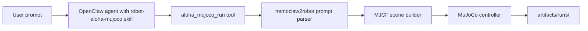
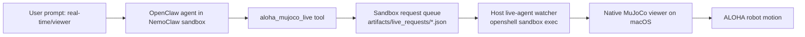

# NemoClaw2Robot Architecture

## Boundary

`NemoClaw/` and `external/mujoco_menagerie/` are git submodules and remain untouched.
This repository adds the robot-specific layer beside it:

```text
NemoClaw2Robot/
├── NemoClaw/                         # upstream submodule, read-only here
├── external/mujoco_menagerie/        # official MuJoCo Menagerie models, read-only here
├── .agents/skills/robot-aloha-mujoco # skill installed into NemoClaw/OpenClaw
├── openclaw-plugins/aloha-mujoco     # OpenClaw tools installed beside NemoClaw
├── src/nemoclaw2robot/               # prompt, scene, controller, CLI
├── scripts/                          # host convenience wrappers
└── artifacts/                        # generated run outputs, ignored by git
```

## Flow



Live viewer flow:



## First Supported Robot

The first robot profile is `aloha`.
It loads the official ALOHA 2 MJCF from Google DeepMind's MuJoCo Menagerie and adds task objects such as the cube, target pad, and push lane in project-generated MJCF.

This is the right first layer for NemoClaw integration because the agent can:

1. Normalize a natural-language task.
2. Generate a scene deterministically.
3. Run or skip MuJoCo depending on dependency availability.
4. Return machine-readable artifacts for later policy or controller upgrades.

The OpenClaw plugin is stored in this repository and installed into the sandbox with `scripts/install_robot_skill.sh`.
It does not modify the upstream `NemoClaw/` submodule; it only registers tools that call this project's CLI under `/sandbox/NemoClaw2Robot`.
For Agent-controlled live viewing, the host must also run `scripts/live_aloha_agent_viewer.sh <sandbox-name>`; the sandbox cannot open the macOS MuJoCo window by itself.
